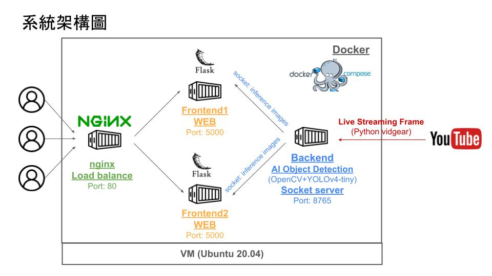

# 以YouTube直播畫面做YOLO物件偵測模型

## 一、專案簡介

本專案以[Youtube: 桃園大溪老街即時影像](https://www.youtube.com/watch?v=z_mlibCfgFI)做為範例，透過Python的[VidGear](https://github.com/abhiTronix/vidgear)套件，將即時影像接入Python內。接下來以OpenCV載入YOLOv4-tiny模型，進行物件偵測。並將物件偵測完後的照片，以socket方式傳到Flask搭建的WEB前端，提供給使用者觀看。

## 二、執行成果範例

在WEB上，使用者可以看到以下畫面：


## 三、系統架構

本專案在VMware虛擬機上，以Docker Compose搭建4個容器，共有2個前端，1個後端，以及Nginx做負載平衡。



## 四、程式說明

* backend: 負責接收Youtube串流影像及物件偵測，並以socket方式將照片傳入到前端
    * yolo_model: YOLOv4-tiny的設定檔與權重檔，下載位置:[[Github: AlexeyAB/darknet](https://github.com/AlexeyAB/darknet)]
    * Dockerfile: Docker部署相關設定
    * requirements.txt: Python所需相關套件
    * server.py: 負責接收Youtube即時影像，進行物件偵測後以socket方式傳輸給Frontend
    * yolo_detect.py: 物件偵測程式 
* frontend: 以Flask建立的WEB
    * templates: Flask模板
    * app.py: Flask Web，以socket方式接收backend傳來物件偵測後的照片
    * Dockerfile: Docker部署相關設定
    * requirements.txt: Python所需相關套件
* nginx: 用於負載平衡
    * default.conf: Nginx設定檔案
    * Dockerfile: Docker部署相關設定
* docker-compose.yml: docker compose設定檔

## 五、執行方式

在有安裝Docker的Linux環境下，執行以下指令：

```
git clone https://github.com/SuYenTing/live_streaming_object_detect.git

cd live_streaming_object_detect

docekr compose up -d
```

部署完後，輸入本機IP即可查看WEB接收到物件偵測辨識完後的影片。

## 六、參考資料
* [pyimagesearch: YOLO object detection with OpenCV](https://pyimagesearch.com/2018/11/12/yolo-object-detection-with-opencv/)
* [Python VidGear: CamGear API Usage Examples](https://abhitronix.github.io/vidgear/v0.2.5-stable/gears/camgear/usage/)
* [Github: jonec76jonec76/w14_socket](https://github.com/jonec76/w14_socket)
* [stackoverflow: Send webcam stream from server in Python using sockets](https://stackoverflow.com/questions/59587166/send-webcam-stream-from-server-in-python-using-sockets)
* [Github: NakulLakhotia/Live-Streaming-using-OpenCV-Flask](https://github.com/NakulLakhotia/Live-Streaming-using-OpenCV-Flask)